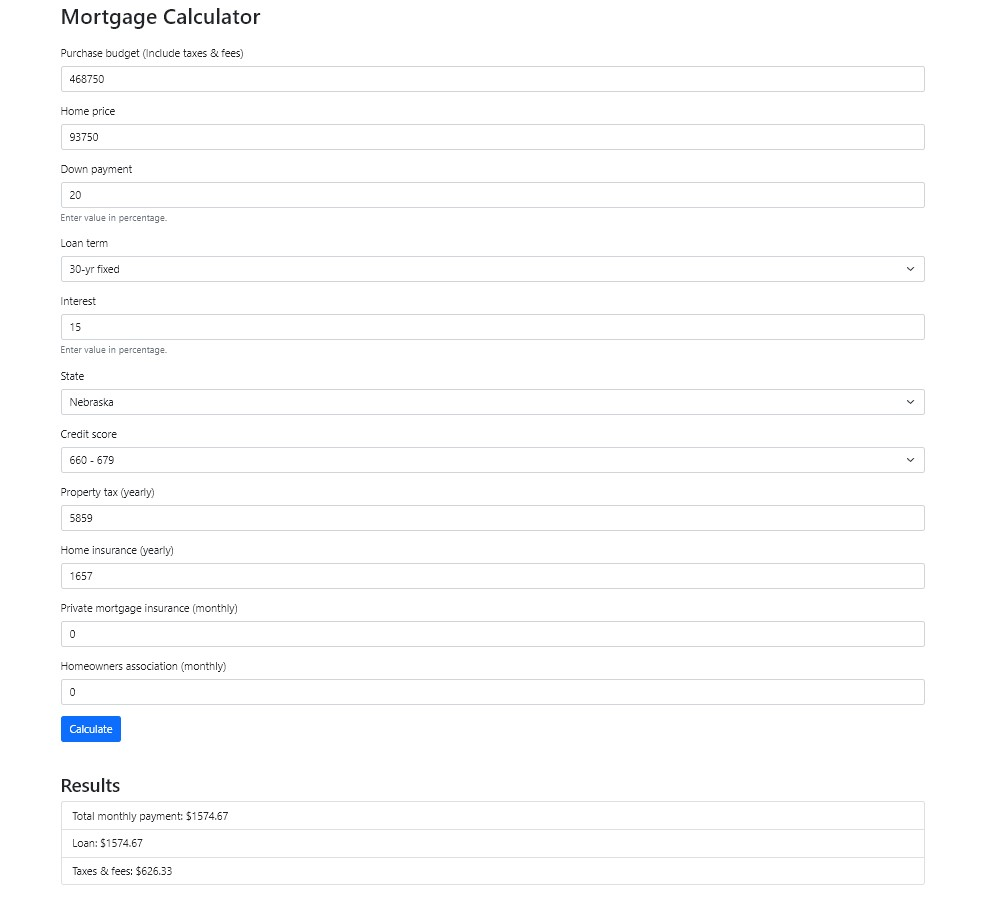

Certainly! Here's a sample `README.md` for the Mortgage Calculator:

---

# Mortgage Calculator

A simple yet powerful mortgage calculator built using Bootstrap 5 and JavaScript. This calculator takes into account various parameters like home price, down payment, interest rate, state, credit score, property tax, and more to give you a comprehensive overview of your monthly mortgage payment.

  

## Features

- Responsive design using Bootstrap 5.
- Comprehensive input fields, including:
  - Home Price
  - Down Payment (in %)
  - Loan Term
  - Interest Rate
  - State
  - Credit Score
  - Yearly Property Tax
  - Yearly Home Insurance
  - Monthly Private Mortgage Insurance
  - Monthly Homeowners Association Fee
- Instant calculation of:
  - Total Monthly Payment
  - Loan Component
  - Taxes & Fees

## Usage

1. Clone the repository:
   ```bash
   git clone https://github.com/yourusername/mortgage-calculator.git
   ```

2. Navigate to the directory:
   ```bash
   cd mortgage-calculator
   ```

3. Open `index.html` in your preferred browser.

## Customization

You can easily customize this calculator to fit your needs. If you want to add more states or loan terms, simply update the select dropdown options in the `index.html` file.

## Contribution

Pull requests are welcome. For major changes, please open an issue first to discuss what you would like to change.

## License

[MIT](https://choosealicense.com/licenses/mit/)

---

Replace placeholders like `https://github.com/yourusername/mortgage-calculator.git` with actual links as needed. Also, consider taking a screenshot of the calculator in action and including it in the README for a visual overview.
